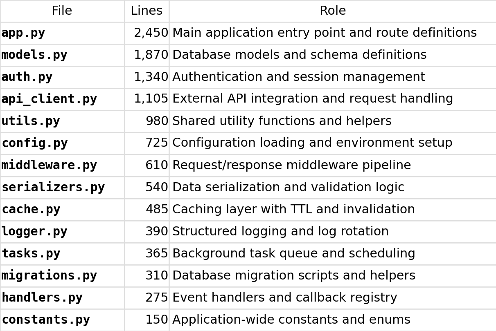

# DrawAsciiPNG

## Why we need this:

Sometimes, we need to study other code base repo. And for those large and complex code base, it's better to use Claude Code
to do some analysis to find the structure of the code repo and the function of each part. And Calude Code will give us some 
well drawn ASCII tables. But if we want to save those tables to Word document, their format will break. We can save them as
csv file and process them in Excel manually, but that will add manual work.

This Python program is to address this. It will take in csv file as input, and draw a PNG table based on the input and also
output the markdown file of the csv file. So we can document those data to our project document or notes to help us study 
those code base repos.

Some may ask why we don't just ask Claude Code to draw the PNG table for us? If you try that, you will find out the PNG file
is very different from the ASCII table you see on Claude Code console.

## Example:

'
File,Lines,Role
app.py,"2,450",Main application entry point and route definitions
models.py,"1,870",Database models and schema definitions
auth.py,"1,340",Authentication and session management
api_client.py,"1,105",External API integration and request handling
utils.py,980,Shared utility functions and helpers
config.py,725,Configuration loading and environment setup
middleware.py,610,Request/response middleware pipeline
serializers.py,540,Data serialization and validation logic
cache.py,485,Caching layer with TTL and invalidation
logger.py,390,Structured logging and log rotation
tasks.py,365,Background task queue and scheduling
migrations.py,310,Database migration scripts and helpers
handlers.py,275,Event handlers and callback registry
constants.py,150,Application-wide constants and enums
'
## Result:

| File | Lines | Role |
| --- | --- | --- |
| app.py | 2,450 | Main application entry point and route definitions |
| models.py | 1,870 | Database models and schema definitions |
| auth.py | 1,340 | Authentication and session management |
| api_client.py | 1,105 | External API integration and request handling |
| utils.py | 980 | Shared utility functions and helpers |
| config.py | 725 | Configuration loading and environment setup |
| middleware.py | 610 | Request/response middleware pipeline |
| serializers.py | 540 | Data serialization and validation logic |
| cache.py | 485 | Caching layer with TTL and invalidation |
| logger.py | 390 | Structured logging and log rotation |
| tasks.py | 365 | Background task queue and scheduling |
| migrations.py | 310 | Database migration scripts and helpers |
| handlers.py | 275 | Event handlers and callback registry |
| constants.py | 150 | Application-wide constants and enums |
